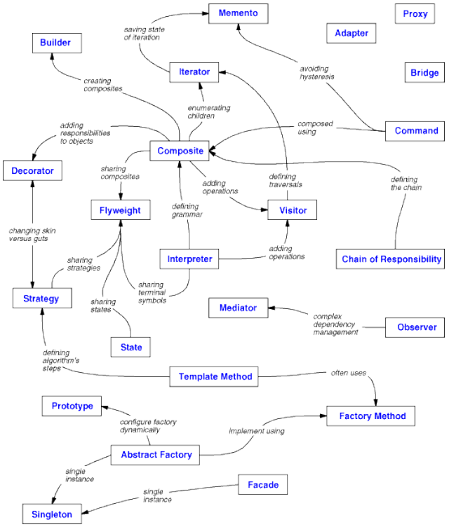

# Design Patterns

This project implements the _Design Patterns_ defined by the so-called _Gang of Four_ (Gamme, Helm, Johnson,
Vlissides) in Java. The idea is to a kind of reference/documentation that is less abstract than the book and thus
can be easier applied to real world projects.

The patterns are implemented using Java 8.

## Design Patterns by the GoF

In the book a total amount of 23 patterns are presented. All patterns are categorized into one of three categories:
**Creational Patterns**, **Behavioral Patterns** and **Structural Patterns**. All patterns are connected with each other,
as shown in the following illustration.



### Book Reference
```
Design Patterns. Elements of Reusable Object-Oriented Software
Erich Gamma, Richard Helm, Ralph Johnson, John Vlissides
Addison-Wesley, 1994
ISBN: 978-0201633610
```
