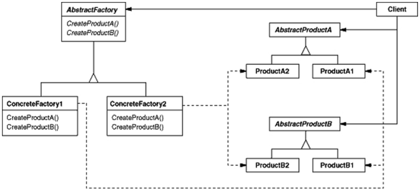

# Abstract Factory

 
## About

The abstract factory is an object-based creational pattern. It provides an interface for creating families of related
or dependent objects without specifying their concrete classes.

### Applicability

Use the Abstract Factory pattern when

* a system should be independent of how its products are created, composed, and represented.
* a system should be configured with one of multiple families of products.
* a family of related product objects is designed to be used together, and you need to enforce this constraint.
* you want to provide a class library of products, and you want to reveal just their interfaces, not their
implementations.

### Collaborations

*  Normally a single instance of a ConcreteFactory class is created at run-time. This concrete factory creates product
objects having a particular implementation. To create different product objects, clients should use a different
concrete factory.
* AbstractFactory defers creation of product objects to its ConcreteFactory subclass.

### Consequences

* It isolates concrete classes
* It makes exchanging product families easy
* It promotes consistency among products
* Supporting new kinds of products is difficult

### Related Patterns

AbstractFactory classes are often implemented with factory methods (Factory Method ), but they can also be
implemented using Prototype.

A concrete factory is often a singleton (Singleton ).
