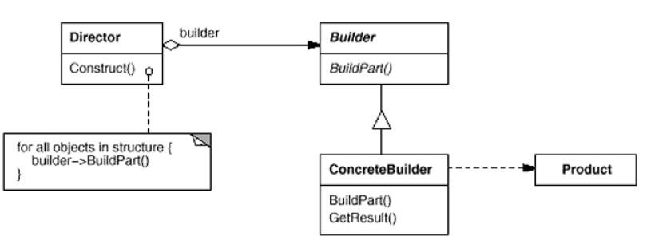

# Builder

## About

The builder is an object-based creational pattern. Separate the construction of a complex object from its representation
so that the same construction process can create different representations.

### Applicability

Use the Builder pattern when

* the algorithm for creating a complex object should be independent of the parts that make up the object and how
they're assembled.
* the construction process must allow different representations for the object that's constructed.

### Collaborations

* The client creates the Director object and configures it with the desired Builder object.
* Director notifies the builder whenever a part of the product should be built.
* Builder handles requests from the director and adds parts to the product.
* The client retrieves the product from the builder.

### Consequences

* It lets you vary a product's internal representation
* It isolates code for construction and representation
* It gives you finer control over the construction process

### Related Patterns

Abstract Factory is similar to Builder in that it too may construct complex objects. The primary difference is
that the Builder pattern focuses on constructing a complex object step by step. Abstract Factory's emphasis is
on families of product objects (either simple or complex). Builder returns the product as a final step, but as far
as the Abstract Factory pattern is concerned, the product gets returned immediately.

A Composite is what the builder often builds.
