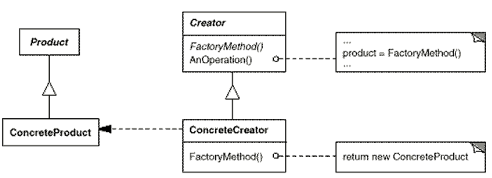

# Factory Method

## About

Define an interface for creating an object, but let subclasses decide which class to instantiate. Factory Method lets
a class defer instantiation to subclasses.

### Applicability

Use the Factory Method pattern when

* a class can't anticipate the class of objects it must create.
* a class wants its subclasses to specify the objects it creates.
* classes delegate responsibility to one of several helper subclasses, and you want to localize the knowledge of which
helper subclass is the delegate.

### Collaborations

* Creator relies on its subclasses to define the factory method so that it returns an instance of the appropriate
ConcreteProduct.

### Consequences

* Provides hooks for subclasses
* Connects parallel class hierarchies

### Related Patterns

Abstract Factory is often implemented with factory methods. The Motivation example in the Abstract Factory pattern
illustrates Factory Method as well.

Factory methods are usually called within Template Methods.

Prototypes don't require subclassing Creator. However, they often require an Initialize operation on the Product class.
Creator uses Initialize to initialize the object. Factory Method doesn't require such an operation.
