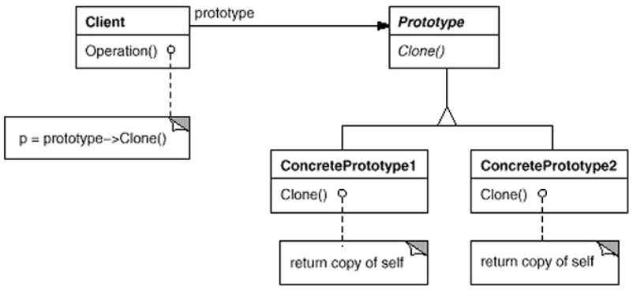

# Prototype

## About

Specify the kinds of objects to create using a prototypical instance, and create new objects by copying this
prototype.

### Applicability

Use the Prototype pattern when a system should be independent of how its products are created, composed,
and represented; and

* when the classes to instantiate are specified at run-time, for example, by dynamic loading; or
* to avoid building a class hierarchy of factories that parallels the class hierarchy of products; or
* when instances of a class can have one of only a few different combinations of state. It may be more
convenient to install a corresponding number of prototypes and clone them rather than instantiating
the class manually, each time with the appropriate state.

### Collaborations

* A client asks a prototype to clone itself.

### Consequences

Consequences are similar to those of the Abstract Factory and Builder patterns. Additional benefits of the
prototype pattern are:

* Adding and removing products at runtime
* Specifying new objects by varying values
* Specifying new objects by varying structure
* Reduced subclassing
* Configuring an application with classes dynamically

### Related Patterns

Prototype and Abstract Factory are competing patterns in some ways. They can also be used together, however. An
Abstract Factory might store a set of prototypes from which to clone and return product objects. Designs that make
heavy use of the Composite and Decorator patterns often can benefit from Prototype as well.
